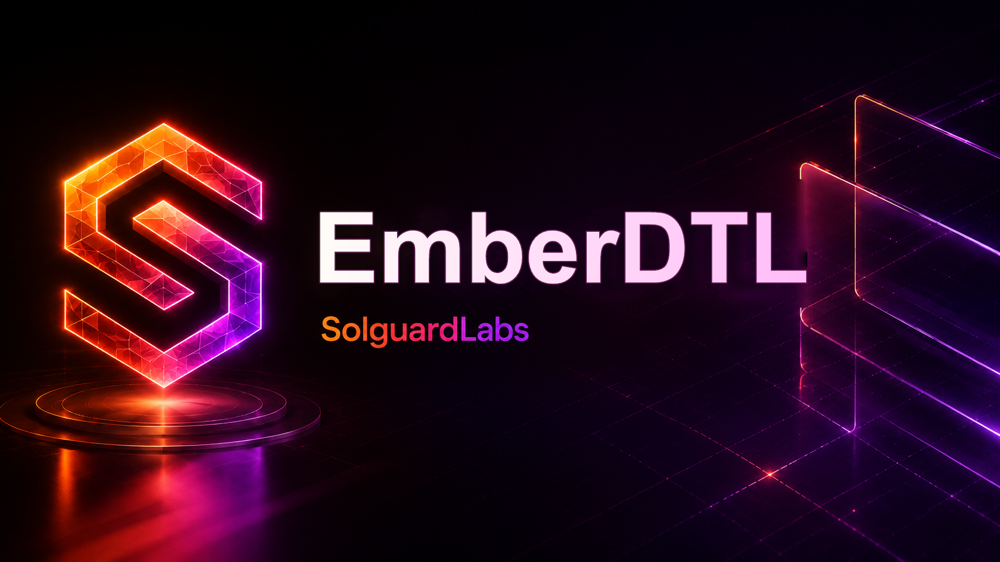

# EmberDTL



EmberDTL es un servicio Go de liquidacion diferida con reservas internas y un
pool de seguro por activo. El sistema modela facilities financiadas por buckets
de reserva, repayments con fees operativas, contribuciones de underwriters,
defaults reportados y pagos de cobertura a beneficiarios.

La API publica se ejecuta mediante escenarios JSON deterministas. Esto permite
revisar el comportamiento del motor sin dependencias externas, reproducir
flujos de accounting y comparar reportes entre ejecuciones.

## Componentes

- `src/domain`: entidades de activos, cuentas, reservas, facilities, defaults,
  claims, pools y reportes.
- `src/policy`: parametros economicos de fees, contribuciones y cobertura.
- `src/risk`: evaluacion de facilities, defaults y claims.
- `src/insurance`: movimientos del pool de cobertura.
- `src/ledger`: journal contable por epoch, activo y entidad.
- `src/engine`: servicio principal y comandos de negocio.
- `src/scenario`: loader y runner de fixtures JSON.
- `tests/node`: tests TypeScript de integracion contra el binario Go.

## Requisitos

- Go 1.22 o superior.
- Node.js 24 o superior para tests TypeScript con
  `--experimental-strip-types`.
- Bash para ejecutar los scripts de CI local.

## Uso

Compilar el binario:

```bash
node scripts/build.mjs
```

Ejecutar un escenario:

```bash
bin/emberdtl run tests/fixtures/claim_payment.json --json
```

Validar un escenario:

```bash
bin/emberdtl validate tests/fixtures/reserve_cycle.json
```

Ejecutar tests:

```bash
npm test
```

Ejecutar la validacion completa:

```bash
npm run ci
```

## Flujo Operativo

1. Se registran activos y cuentas participantes.
2. Se abre un bucket de reserva por activo.
3. La tesoreria deposita liquidez en la reserva.
4. Underwriters o fees de settlement alimentan el pool de seguro.
5. Una facility se abre desde una reserva y entrega principal al beneficiario.
6. El borrower realiza repayments que reducen outstanding y pagan fees.
7. Si una facility queda vencida, un operador puede reportar default.
8. Claims admitidos se pagan desde el pool de cobertura del activo.
9. Recoveries posteriores se acreditan de vuelta al pool.

## Estado

El repositorio incluye fixtures para reservas, repayments, defaults, claims,
recoveries y separacion multi-activo. Los reportes JSON contienen balances,
eventos opcionales, metricas y reconciliacion por activo.
