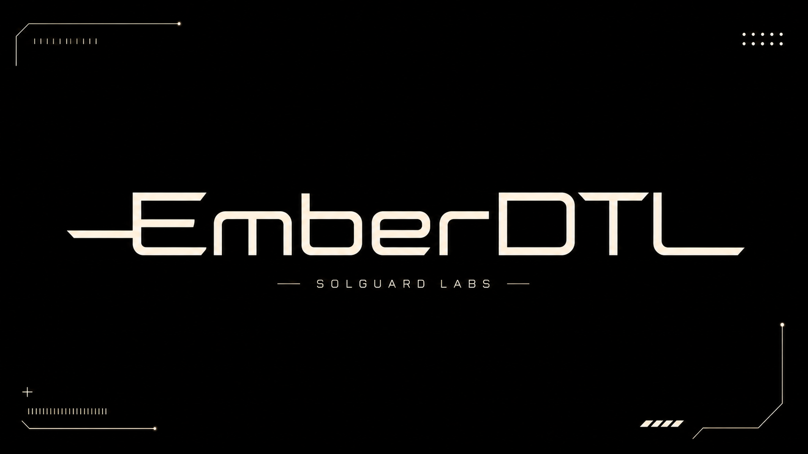
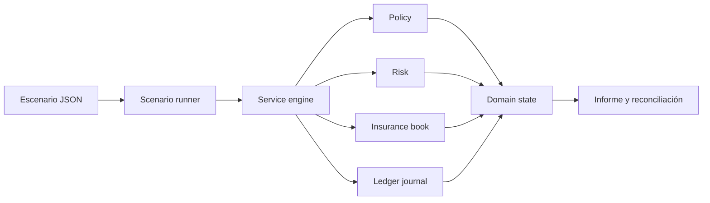
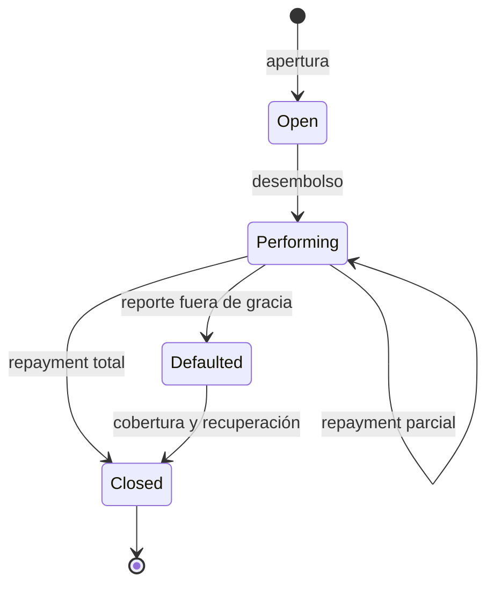
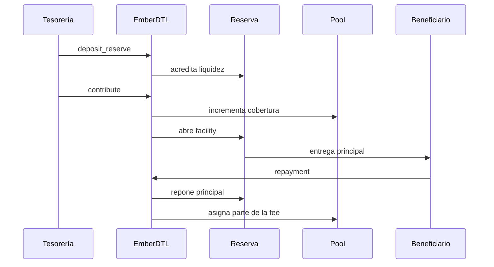
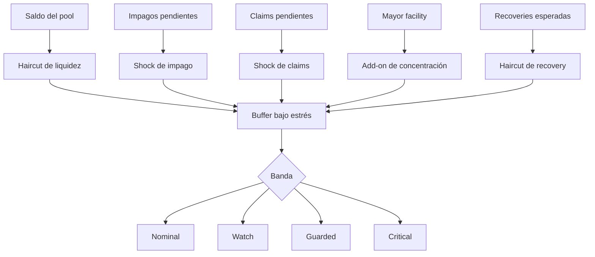

# EmberDTL



[](https://github.com/SolguardLabs/EmberDTL/actions/workflows/ci.yml)
[](https://github.com/SolguardLabs/EmberDTL/actions/workflows/release-integrity.yml)
[](https://go.dev/)
[](https://nodejs.org/)

EmberDTL es un motor determinista de liquidación diferida para redes de pagos B2B. Coordina reservas segregadas, facilidades de crédito, cobros, comisiones, fondos de cobertura por activo y procesos de recuperación sin depender de servicios externos durante el cálculo contable.

El binario recibe escenarios JSON, ejecuta todas las transiciones en orden y produce un informe reconciliable. Esta interfaz sirve tanto para simulación financiera como para integración en un plano de control que autentique y ordene solicitudes antes de entregarlas al motor.

## Arquitectura


```mermaid
flowchart LR
    A["Escenario JSON"] --> B["Scenario runner"]
    B --> C["Service engine"]
    C --> P["Policy"]
    C --> R["Risk"]
    C --> I["Insurance book"]
    C --> L["Ledger journal"]
    P --> D["Domain state"]
    R --> D
    I --> D
    L --> D
    D --> O["Informe y reconciliación"]
```

| Componente      | Responsabilidad                                                    |
| --------------- | ------------------------------------------------------------------ |
| `src/domain`    | Entidades, estados, agregados y proyecciones de informe.           |
| `src/policy`    | Límites de principal, comisiones, cobertura y ventanas temporales. |
| `src/risk`      | Evaluación previa de facilidades, impagos y reclamaciones.         |
| `src/insurance` | Movimientos del fondo de cobertura y recuperaciones.               |
| `src/ledger`    | Asientos deterministas por época, activo y entidad.                |
| `src/solvency`  | Modelo independiente de liquidez bajo estrés y concentración.      |
| `src/engine`    | Orquestación de comandos y transiciones de negocio.                |
| `src/scenario`  | Decodificación y ejecución secuencial de escenarios.               |
| `sdk`           | Cliente TypeScript con límites de tiempo, salida y validación.     |

## Ciclo de una facilidad


```mermaid
stateDiagram-v2
    [*] --> Open: apertura
    Open --> Performing: desembolso
    Performing --> Performing: repayment parcial
    Performing --> Closed: repayment total
    Performing --> Defaulted: reporte fuera de gracia
    Defaulted --> Closed: cobertura y recuperación
    Closed --> [*]
```


```mermaid
sequenceDiagram
    participant T as Tesorería
    participant E as EmberDTL
    participant R as Reserva
    participant P as Pool
    participant M as Beneficiario
    T->>E: deposit_reserve
    E->>R: acredita liquidez
    T->>E: contribute
    E->>P: incrementa cobertura
    E->>R: abre facility
    R->>M: entrega principal
    M->>E: repayment
    E->>R: repone principal
    E->>P: asigna parte de la fee
```

Las cantidades se representan como enteros en unidades mínimas del activo. No se usa coma flotante. Para una liquidación de importe `x`, la comisión se calcula con redondeo superior y límites configurables:

```text
fee(x) = clamp(ceil(x × settlementFeeBps / 10_000), minFee, maxFee)
insuranceShare = floor(fee(x) × insuranceFeeShareBps / 10_000)
operatorShare = fee(x) - insuranceShare
```

## Modelo de solvencia

El módulo `src/solvency` aplica haircuts y shocks sobre una instantánea por activo. El cálculo es independiente del motor transaccional y puede ejecutarse como control previo, métrica operativa o comparación de escenarios.


```mermaid
flowchart TD
    PB["Saldo del pool"] --> H["Haircut de liquidez"]
    PD["Impagos pendientes"] --> DS["Shock de impago"]
    PC["Claims pendientes"] --> CS["Shock de claims"]
    LF["Mayor facility"] --> CA["Add-on de concentración"]
    ER["Recoveries esperadas"] --> RH["Haircut de recovery"]
    H --> B["Buffer bajo estrés"]
    DS --> B
    CS --> B
    CA --> B
    RH --> B
    B --> K{"Banda"}
    K --> N["Nominal"]
    K --> W["Watch"]
    K --> G["Guarded"]
    K --> C["Critical"]
```

```text
L = floor(poolBalance × (10_000 - liquidityHaircutBps) / 10_000)
D = ceil(pendingDefaults × (10_000 + defaultShockBps) / 10_000)
C = ceil(pendingClaims × (10_000 + claimShockBps) / 10_000)
A = ceil(largestFacility × concentrationAddonBps / 10_000)
R = floor(expectedRecoveries × (10_000 - recoveryHaircutBps) / 10_000)
required = max(D + C + A - R, 0)
buffer = L - required
```

## Inicio rápido

Requisitos: Go `1.22.x`, Node.js `24.x` y Bash.

```bash
npm ci
npm run build
bin/emberdtl run tests/fixtures/claim_payment.json --json
bin/emberdtl validate tests/fixtures/multi_asset.json --json
npm test
npm run ci
```

Uso desde TypeScript:

```ts
import { EmberClient } from "./sdk/client.ts";

const client = new EmberClient({
  binaryPath: "bin/emberdtl",
  cwd: process.cwd(),
  timeoutMs: 5_000,
});

const report = client.runScenario("tests/fixtures/reserve_cycle.json");
console.log(report.reconciliation);
```

El cliente ejecuta el binario sin shell, valida rutas y esquema de respuesta, impone timeout y limita el tamaño de salida. En Windows se debe indicar `bin/emberdtl.exe`.

## Documentación

- [Arquitectura](docs/01-arquitectura.md)
- [Modelo económico](docs/02-modelo-economico.md)
- [Solvencia y estrés](docs/03-solvencia-y-estres.md)
- [Operación](docs/04-operacion.md)
- [Integración](docs/05-integracion.md)
- [Observabilidad](docs/06-observabilidad.md)
- [Despliegue](docs/07-despliegue.md)
- [Política de seguridad](SECURITY.md)

## Garantías de ingeniería

- Ejecución determinista y sin acceso de red.
- Aritmética entera comprobada para las rutas auxiliares.
- Separación contable por activo.
- Fixtures multi-activo y reconciliación reproducible.
- Modelo de estrés con señales ordenadas y resultados estables.
- CI en Linux y Windows, análisis estático, formato y verificación documental.
- Releases anotadas y verificadas contra `production`.

## Licencia

Distribuido bajo los términos de [MIT](LICENSE).
