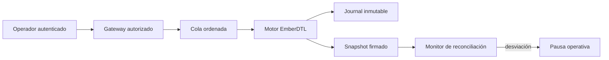
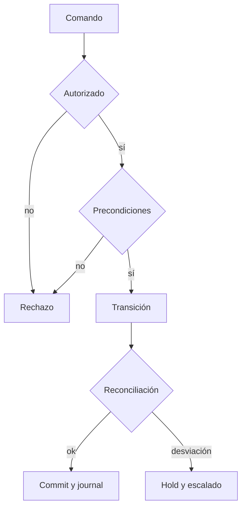

# Política de seguridad

## Versiones mantenidas

| Serie   | Estado            |
| ------- | ----------------- |
| `1.x`   | Mantenida         |
| `< 1.0` | Sin mantenimiento |

La rama `main` representa el estado integrado. La rama `production` identifica el commit publicado y cada entrega estable se marca con un tag anotado `vMAJOR.MINOR.PATCH`.

## Límites de confianza

EmberDTL es un motor contable. El entorno que lo integra debe autenticar al emisor, autorizar cada rol, limitar el tamaño de la entrada, almacenar el estado durable y serializar comandos concurrentes. El binario no sustituye esos controles de plataforma.



## Controles exigidos al integrador

- Mapear identidades externas a roles mínimos y negar por defecto.
- Verificar unicidad de identificadores antes de aceptar un comando.
- Aplicar exclusión mutua por activo o versión optimista de estado.
- Fijar límites de entrada, timeout y memoria del proceso.
- Persistir entrada, hash del ejecutable, salida y número de secuencia.
- Comparar saldos con una fuente contable independiente.
- Prohibir cambios de política dentro de una ejecución abierta.
- Tratar toda salida negativa o desbordamiento como evento de parada.

## Invariantes operativas



Las siguientes relaciones deben observarse por activo y por época:

```text
free >= 0
held >= 0
reserve.balance >= 0
pool.balance observado >= 0
facility.outstanding <= facility.principal
claimedCoverage <= coverageCeiling
netCoverageBuffer = poolBalance - pendingDefaults - pendingClaims
```

El informe de reconciliación es una proyección, no una autorización. Las decisiones de disponibilidad deben incorporar la política vigente, compromisos pendientes, orden de ejecución y controles de concurrencia del entorno.

## Comunicación responsable

Los hallazgos deben enviarse mediante **GitHub Security Advisories** en la pestaña Security del repositorio. No se deben abrir issues públicos con escenarios que puedan afectar operaciones desplegadas.

Incluya:

- versión, commit y plataforma;
- escenario JSON mínimo y determinista;
- resultado esperado y observado;
- impacto contable por activo;
- logs sin credenciales ni datos personales;
- propuesta de prueba de regresión, si existe.

Se confirmará la recepción, se reproducirá el caso en un entorno aislado y se coordinará la publicación de la corrección. No se garantiza soporte para ramas anteriores a `1.x`.

## Gestión de secretos y dependencias

El repositorio no requiere secretos para compilar ni probar. Los workflows usan permisos mínimos, acciones fijadas por versión mayor mantenida y `npm ci` sobre lockfile. Las credenciales de despliegue pertenecen al entorno consumidor y nunca deben incluirse en escenarios, artefactos o trazas.
