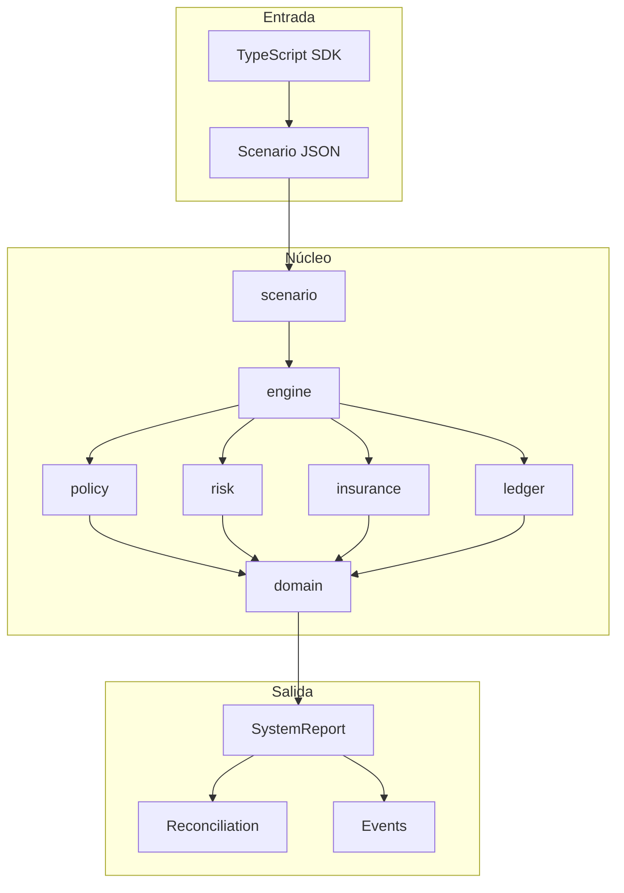
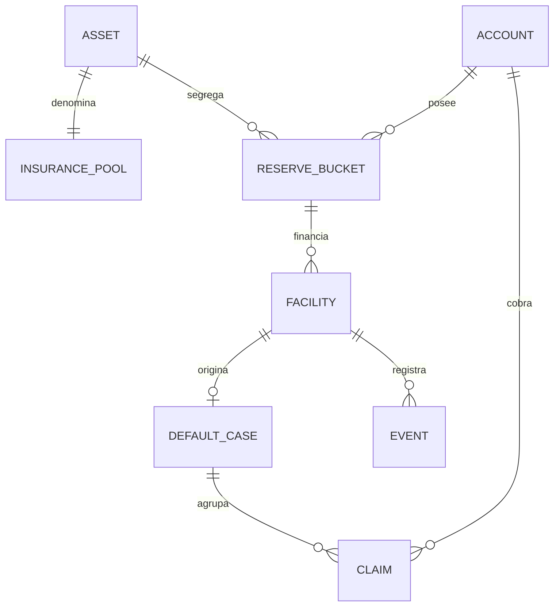
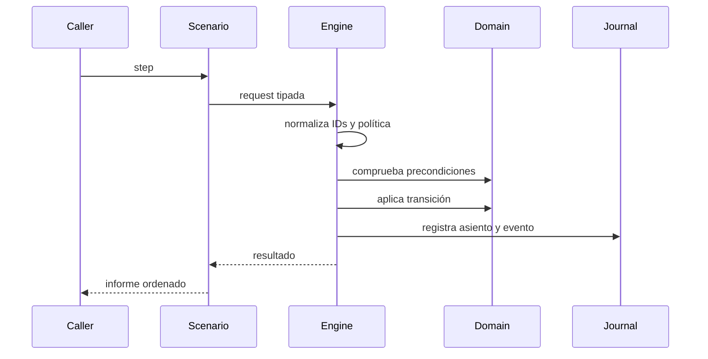

# Arquitectura de EmberDTL

## Objetivo

EmberDTL separa la decisión económica, la transición contable y la presentación de resultados. El núcleo Go no consulta red, reloj de sistema ni bases de datos: recibe una política, un estado inicial y una secuencia ordenada. Esta frontera hace que una misma entrada produzca el mismo informe.

## Agregados

`State` contiene activos, cuentas, pools, reservas, facilidades, impagos, reclamaciones, eventos y métricas. Cada mapa tiene una clave estable; las proyecciones se ordenan antes de serializarse para evitar diferencias por iteración de mapas.

Una `Facility` conserva principal, outstanding, repaid, fees, época de apertura y vencimiento. Un `DefaultCase` conserva importe reportado, techo de cobertura, exposición pendiente, cobertura solicitada y recuperación. El `InsurancePool` concentra contribuciones, comisiones, pagos y recuperaciones de un solo activo.

## Flujo de comando

Los errores se clasifican en entrada inválida, entidad ausente, política, riesgo, estado o solvencia. El caller debe conservar la categoría y no reintentar automáticamente errores deterministas.

## Fronteras de extensión

- Nuevas políticas: funciones puras en `src/policy`.
- Nuevas métricas de stress: `src/solvency`, sin mutar el estado.
- Nuevos comandos: request en `engine`, caso en `scenario` y evento asociado.
- Nuevas proyecciones: tipos de reporte ordenados y compatibles hacia atrás.
- Clientes: procesos sin shell y decodificación estricta.

Una extensión debe mantener compatibilidad del JSON o introducir una versión explícita de esquema. Los campos nuevos deben ser opcionales para consumidores anteriores cuando no alteren la interpretación económica.
