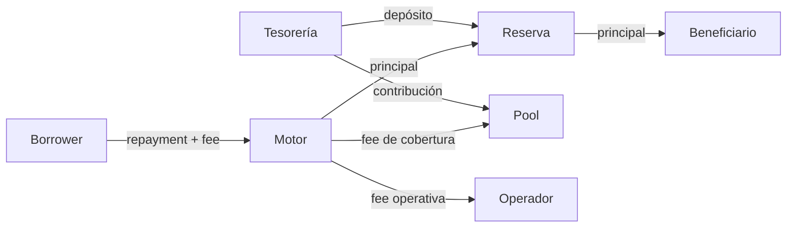
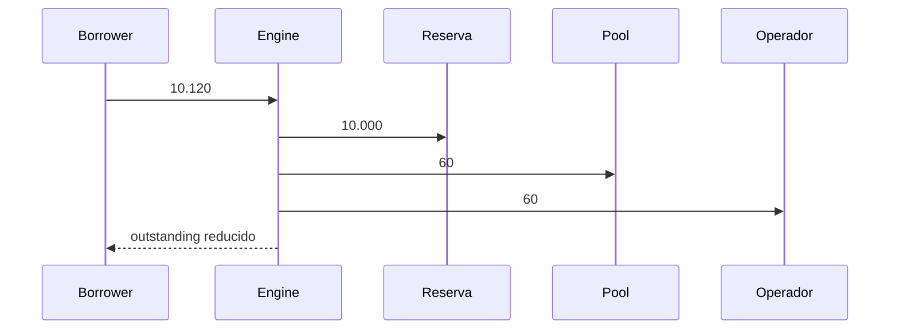
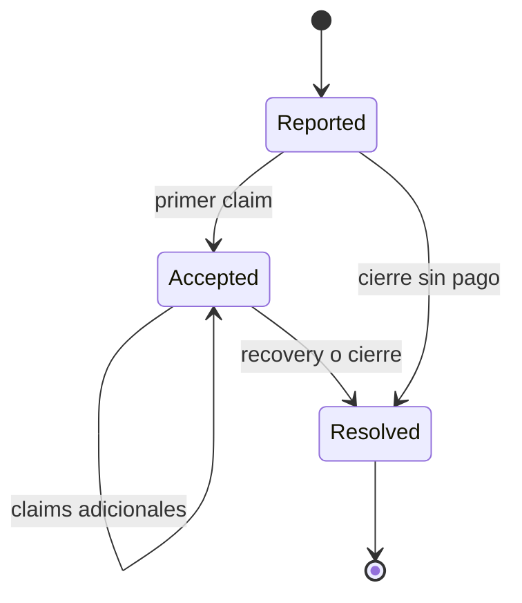

# Modelo económico

## Unidades y participantes

Todos los importes se expresan en unidades mínimas enteras. La precisión pertenece al activo y solo se usa para presentación. Tesorería aporta reservas y cobertura; el beneficiario recibe el desembolso; el borrower devuelve principal y fee; el operador reporta el estado de la facilidad.



## Liquidación de principal y fee

Para un repayment `x`, el motor redondea la fee hacia arriba, la limita entre mínimo y máximo y divide el resultado entre pool y operador.

```text
rawFee = ceil(x × settlementFeeBps / 10_000)
fee = min(max(rawFee, minimumSettlementFee), maximumSettlementFee)
insuranceFee = floor(fee × insuranceFeeShareBps / 10_000)
operatorFee = fee - insuranceFee
borrowerDebit = x + fee
```

Ejemplo con `x = 10.000`, fee `120 bps` y reparto `50/50`:

| Magnitud        | Resultado |
| --------------- | --------: |
| Principal       |    10.000 |
| Fee total       |       120 |
| Pool            |        60 |
| Operador        |        60 |
| Débito borrower |    10.120 |



## Cobertura

El importe reportado genera un techo y una exposición de reserva según la política:

```text
coverageCeiling = floor(defaultAmount × maxDefaultCoverageBps / 10_000)
pendingExposure = floor(defaultAmount × pendingDefaultReserveBps / 10_000)
claimCoverage = min(
  floor(claimAmount × maxDefaultCoverageBps / 10_000),
  coverageCeiling - claimedCoverage
)
```

La recuperación posterior acredita el pool y cierra el caso. Las integraciones deben evaluar compromisos de forma agregada y serializar operaciones por activo.



## Reconciliación

Por activo, el informe publica:

```text
netCoverageBuffer = poolBalance - pendingDefaults - pendingClaims
```

Un valor positivo expresa margen contable instantáneo. No incluye shocks, haircuts ni concentración; para eso se usa el modelo de solvencia. El consumidor debe comparar además reservas, exposición de facilidades y journal, evitando decidir con una sola métrica.
