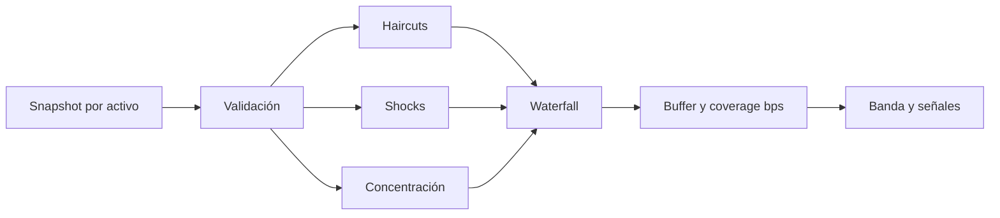
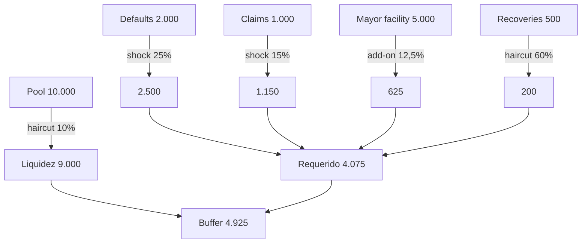
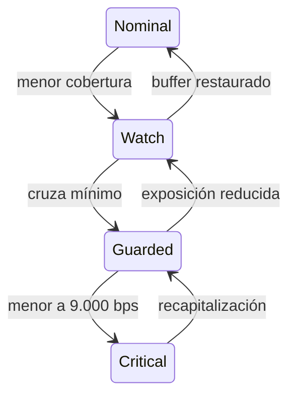

# Solvencia y estrés

## Propósito

`src/solvency` convierte una posición agregada en una evaluación conservadora. No cambia saldos ni autoriza comandos. Su resultado permite definir alertas, límites y revisiones manuales antes de una ventana de liquidación.



## Waterfall

La liquidez disponible recibe un haircut. Impagos y claims pendientes reciben shocks con redondeo superior. Las recuperaciones se reconocen después de un haircut y la mayor facility añade un cargo de concentración.

```text
available = floor(pool × (1 - liquidityHaircut))
stressedDefaults = ceil(pendingDefaults × (1 + defaultShock))
stressedClaims = ceil(pendingClaims × (1 + claimShock))
recognizedRecoveries = floor(expectedRecoveries × (1 - recoveryHaircut))
concentrationAddon = ceil(largestFacility × concentrationAddonRate)
required = max(stressedDefaults + stressedClaims + concentrationAddon
               - recognizedRecoveries, 0)
coverageBps = floor(available × 10_000 / required)
```



## Bandas

| Banda      | Regla por defecto                       | Acción orientativa    |
| ---------- | --------------------------------------- | --------------------- |
| `nominal`  | cobertura ≥ 13.500 bps o requerido cero | operación normal      |
| `watch`    | cobertura ≥ 11.500 bps                  | seguimiento reforzado |
| `guarded`  | cobertura ≥ 9.000 bps                   | limitar crecimiento   |
| `critical` | cobertura < 9.000 bps                   | pausa y revisión      |



Las señales adicionales indican buffer negativo, concentración superior al 50%, reserva inferior a exposición y claims estresados por encima de liquidez. Su orden es determinista para facilitar alertas y comparaciones.

## Ejecución recomendada

Calcule una posición por activo después de cada lote confirmado y antes de abrir nuevas facilidades. Mantenga la política de stress versionada, almacene input y output y compare la banda con el límite aprobado. Un cambio de parámetros debe pasar revisión independiente y análisis retrospectivo.
