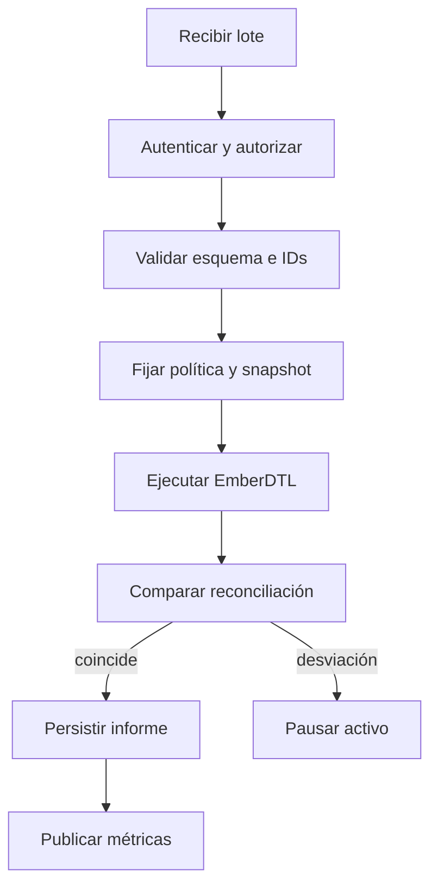
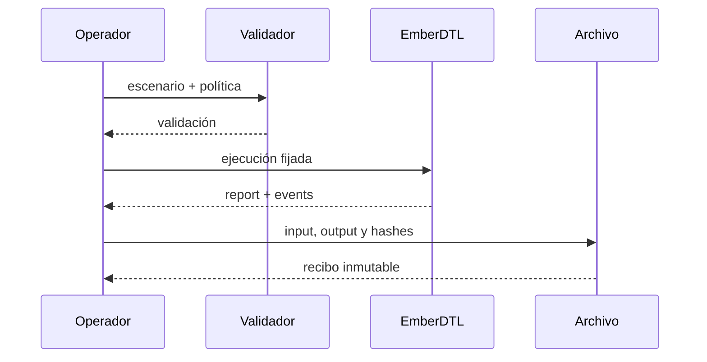
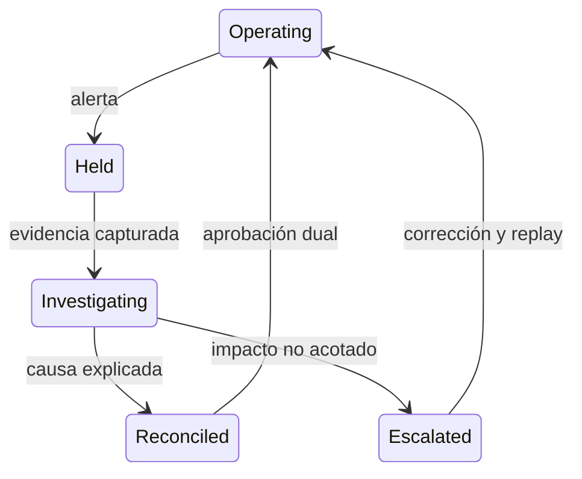

# Operación

## Secuencia diaria

La operación debe separar preparación, ejecución, reconciliación y cierre. Cada lote tiene un identificador externo, una versión de política y un hash del escenario.

## Runbook de lote

1. Verifique versión del binario y checksum.
2. Compruebe que todos los IDs sean únicos en el dominio esperado.
3. Capture política, época inicial y saldos de referencia.
4. Ejecute `validate` sobre el escenario.
5. Ejecute `run --json --events` una sola vez sobre el estado fijado.
6. Reconcilie pool, reservas, exposición, cuentas y número de eventos.
7. Evalúe la posición con el modelo de stress.
8. Confirme o retenga el lote según la banda y las diferencias.

## Respuesta a desviaciones

| Señal               | Primera acción       | Evidencia mínima              |
| ------------------- | -------------------- | ----------------------------- |
| Diferencia de saldo | Pausar el activo     | snapshot, journal, informe    |
| Secuencia duplicada | Retener lote         | ID externo y número de evento |
| Banda `critical`    | Bloquear crecimiento | evaluación y política         |
| Error determinista  | No reintentar        | stderr, exit code, escenario  |
| Timeout             | Aislar proceso       | duración, tamaño y recursos   |

## Continuidad

El replay debe partir del último snapshot confirmado, nunca de una salida parcial. Conserve escenario original, versión, política y orden exacto. Compare el nuevo hash de reporte con el esperado; cualquier diferencia requiere explicación antes de reabrir operaciones.

El binario es stateless entre invocaciones. La durabilidad, exclusión mutua, retención y recuperación ante desastre son responsabilidades del servicio que lo aloja.
