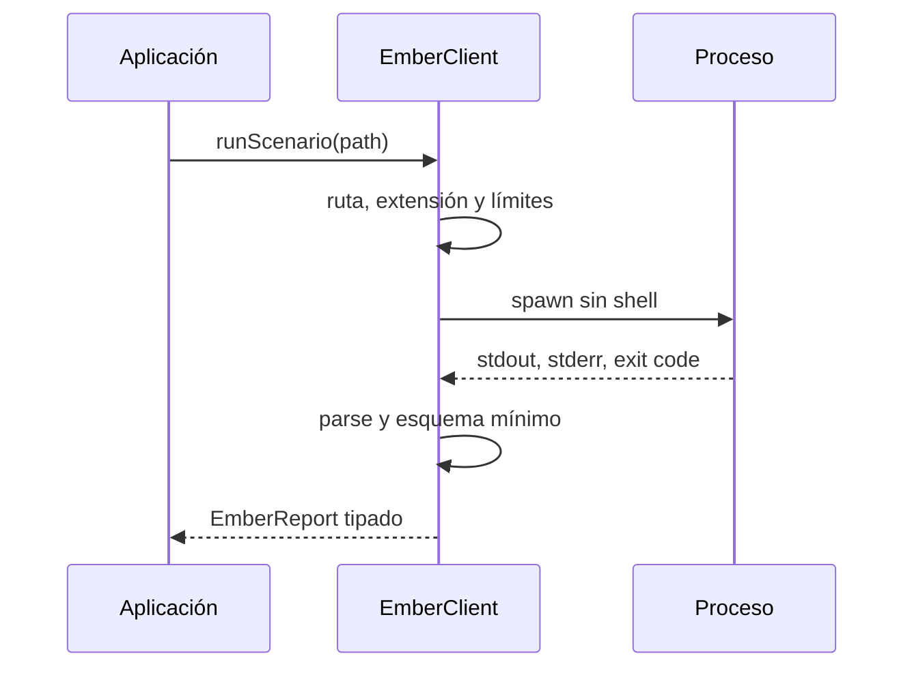
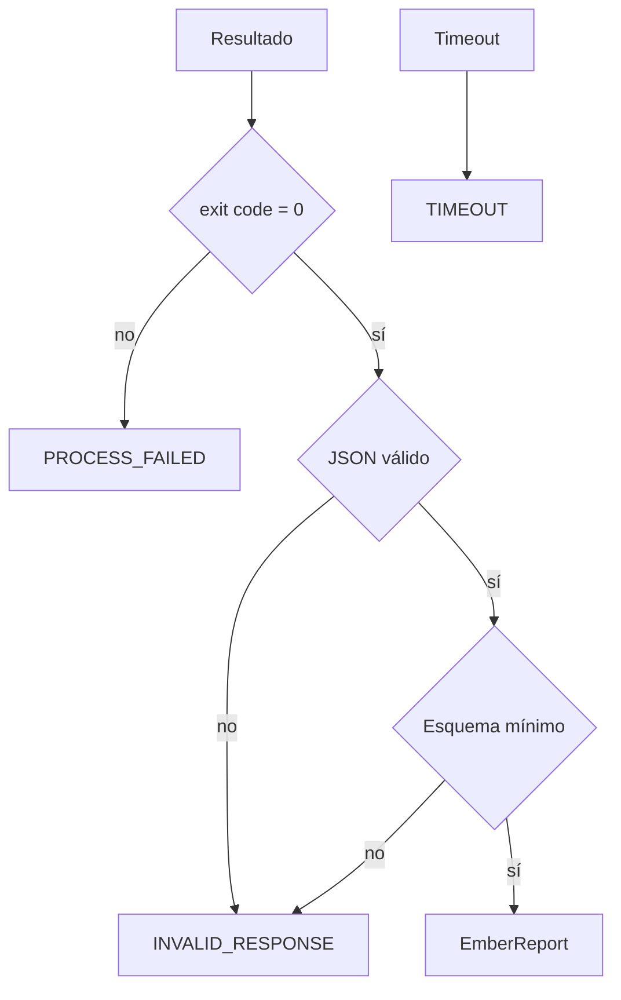
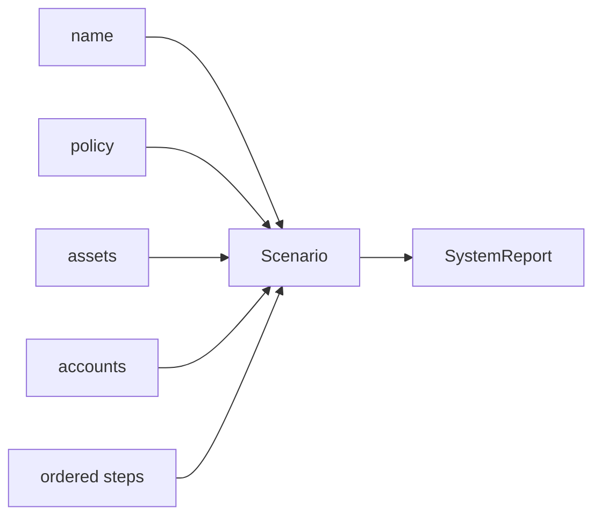

# Integración

## Contrato del proceso

El binario expone dos comandos estables:

```text
emberdtl run <scenario.json> [--json] [--events]
emberdtl validate <scenario.json> [--json]
```

`run` devuelve `SystemReport`; `validate` devuelve un envelope JSON con `status` y `messages`. Un exit code distinto de cero significa que no debe consumirse stdout como resultado de negocio.



## Cliente TypeScript

```ts
const client = new EmberClient({
  binaryPath: process.platform === "win32" ? "bin/emberdtl.exe" : "bin/emberdtl",
  cwd: process.cwd(),
  timeoutMs: 5_000,
  maxOutputBytes: 2 * 1024 * 1024,
});

const report = client.runScenario("input/daily-settlement.json", {
  includeEvents: true,
});
```

El cliente distingue entrada inválida, fallo de proceso, timeout y respuesta inválida. Los consumidores deben mapear estas clases a telemetría y evitar ocultarlas bajo un mensaje genérico.



## Esquema de escenario

El escenario contiene nombre, overrides de política, activos, cuentas y pasos. Cada paso se ejecuta en el orden recibido.

```json
{
  "name": "settlement-eu-042",
  "policy": { "defaultGraceEpochs": 2 },
  "assets": [{ "id": "eur", "symbol": "EUR", "decimals": 2 }],
  "accounts": [{ "id": "treasury", "role": "treasury" }],
  "steps": [{ "action": "fund", "accountId": "treasury", "asset": "eur", "amount": 500000 }]
}
```



## Idempotencia

El motor no asigna idempotency keys externas. El integrador debe impedir que un mismo lote se aplique dos veces usando un registro transaccional `{batchId, inputHash, stateVersion, resultHash}`. Si el proceso termina sin recibo confirmado, recupere el snapshot previo y repita de forma controlada; no concatene una salida parcial.
