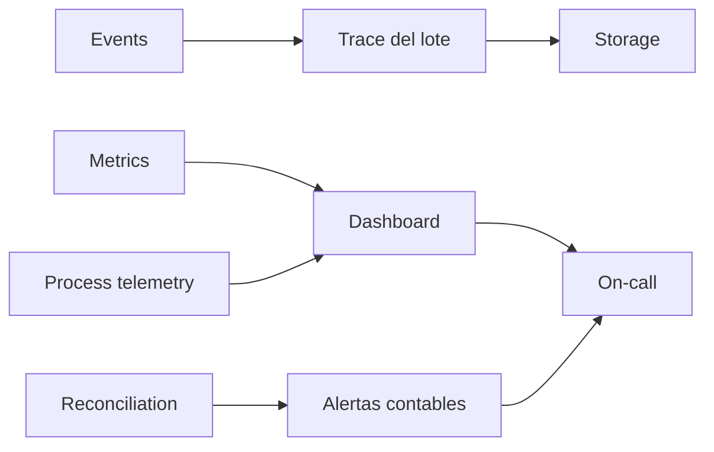
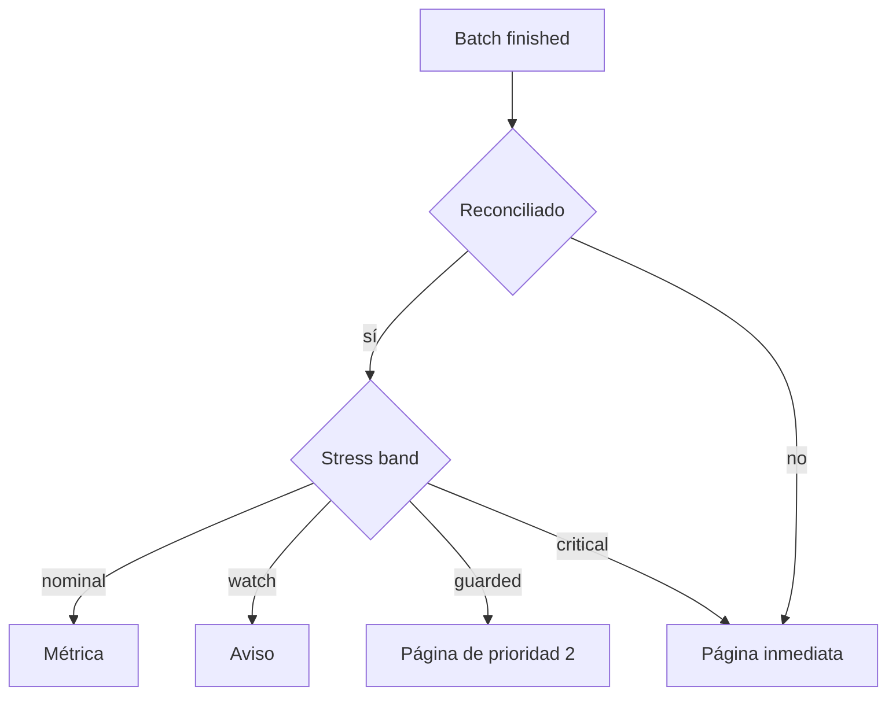
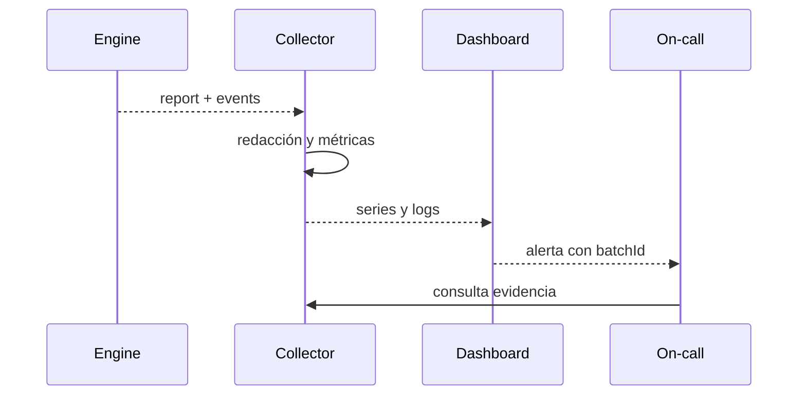

# Observabilidad

## Señales

EmberDTL emite tres superficies complementarias: eventos de dominio, métricas acumuladas e informe de reconciliación. La plataforma debe añadir métricas de proceso y trazabilidad del lote.



## Métricas recomendadas

| Métrica                               | Tipo      | Etiquetas de baja cardinalidad |
| ------------------------------------- | --------- | ------------------------------ |
| `ember_batches_total`                 | counter   | `result`                       |
| `ember_batch_duration_seconds`        | histogram | `command`                      |
| `ember_pool_balance`                  | gauge     | `asset`                        |
| `ember_net_coverage_buffer`           | gauge     | `asset`                        |
| `ember_stress_coverage_bps`           | gauge     | `asset`, `band`                |
| `ember_pending_defaults`              | gauge     | `asset`                        |
| `ember_pending_claims`                | gauge     | `asset`                        |
| `ember_reconciliation_mismatch_total` | counter   | `asset`                        |

No use IDs de cuentas, facilities o claims como labels de métricas. Esos valores pertenecen a logs estructurados o trazas con retención controlada.



## Log estructurado

Cada ejecución debe registrar al menos:

```json
{
  "batchId": "eu-2026-08-15-0042",
  "binaryVersion": "1.0.0",
  "inputSha256": "...",
  "policyName": "ember-mainnet-policy",
  "epoch": 42,
  "durationMs": 83,
  "exitCode": 0,
  "resultSha256": "...",
  "reconciled": true
}
```

No registre secretos, tokens, datos personales ni el contenido completo de cuentas. Los escenarios deben usar identificadores seudónimos y permanecer cifrados cuando salgan del entorno de cálculo.



## SLO orientativo

- Disponibilidad del plano de ejecución: 99,9% mensual.
- Lotes reconciliados: 100% antes de confirmación.
- Latencia p95: definida por tamaño de escenario y entorno.
- Alertas contables: entrega inferior a cinco minutos.
- Evidencia de lote: retención alineada con requisitos financieros.

El SLO nunca convierte una diferencia contable en éxito. La reconciliación es una condición dura, no un porcentaje de disponibilidad.
