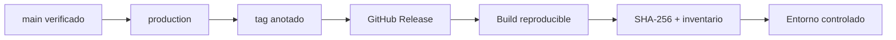
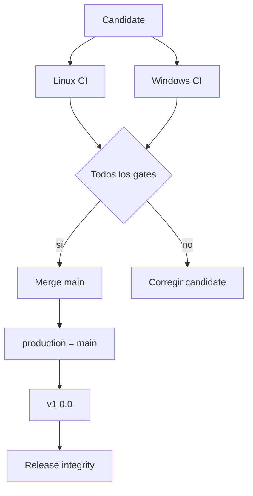
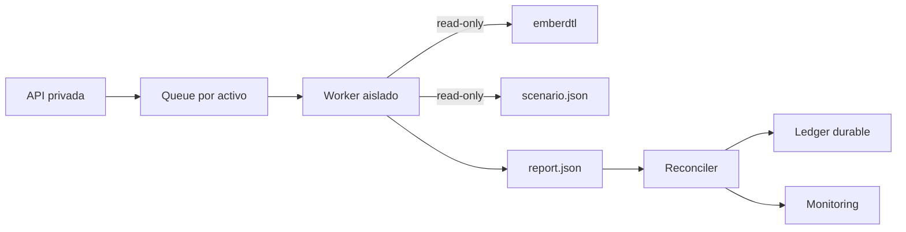

# Despliegue

## Artefactos

Una entrega contiene el código fuente etiquetado, lockfile npm, binario compilado por la organización consumidora y hashes de entrada. El binario no requiere configuración secreta ni conexión de red.



## Gates

Antes de promover:

```bash
npm ci
npm run ci
npm run verify:release
git diff --check
```

El pipeline ejecuta pruebas Go y TypeScript, `go vet`, build, formato, control documental, búsqueda de términos no operativos y comprobación de tamaño del banner. Linux y Windows deben quedar verdes.



## Topología recomendada

Ejecute EmberDTL como proceso aislado, sin shell, con filesystem de solo lectura salvo un directorio temporal y sin red de salida. Monte el escenario de forma inmutable y capture stdout/stderr por separado. La persistencia se realiza fuera del proceso una vez reconciliado el resultado.



## Rollback

Un rollback cambia el binario para lotes futuros; no revierte asientos ya confirmados. Procedimiento:

1. Pause la admisión del activo.
2. Identifique el último lote reconciliado.
3. Verifique tag, commit y checksum de la versión anterior.
4. Despliegue en un worker aislado.
5. Reproduzca fixtures y una copia redactada del último lote.
6. Compare informes y habilite tráfico con aprobación dual.

No reutilice un directorio de trabajo con residuos de una ejecución anterior. El rollout debe fijar CPU, memoria, timeout y límite de salida acordes al tamaño máximo aceptado.
